# BookFetcher - AI Book Content Extraction

An AI-powered application that extracts book content from cover images using **Google Books Embedded Viewer API** and AI browser automation as fallback.

## 🚀 New: Google Books Integration

This project now uses the **official [Google Books Embedded Viewer API](https://developers.google.com/books/docs/overview)** as the primary extraction method:

✅ **Legal & Reliable** - Official Google API, respects copyright  
✅ **No 403 Errors** - No more scraping issues  
✅ **Better UX** - Native Google Books reader embedded in your app  
✅ **Automatic Navigation** - Programmatically access available preview pages  
✅ **Copyright Compliant** - Google handles all permissions automatically  

## Features

- 📸 **Image Validation**: Uses GPT-4 Vision to validate book cover images
- 🔍 **Book Identification**: AI-powered book recognition from cover photos
- 📖 **Google Books Viewer**: Official embedded viewer with preview access
- 🤖 **AI Browser Automation**: Fallback method using browser-use for Archive.org
- 🚀 **Dual Extraction Methods**: Choose between Google Books API or browser automation

## Architecture

### Primary Method: Google Books Embedded Viewer API
1. **GPT-4 Vision** identifies book from cover image
2. **Google Books API** searches for the book and gets volume ID
3. **Embedded Viewer** loads official Google Books reader
4. **Content Extraction** accesses available preview pages programmatically

### Fallback Method: AI Browser Automation  
1. **GPT-4 Vision** identifies book from cover image
2. **browser-use AI** navigates Archive.org automatically
3. **Real-time WebSocket** streaming of browser screenshots
4. **Content Extraction** from 4 pages using AI navigation

## Installation

1. Clone and setup the project:
```bash
git clone <repository-url>
cd BookFethcher
npm install
```

2. Install Python backend dependencies:
```bash
pip install -r requirements_backend.txt
```

3. Create environment file:
```bash
cp .env.example .env
```

4. Add your API keys to `.env`:
```bash
# Required for both methods
OPENAI_API_KEY=your_openai_api_key_here

# Required for Google Books integration (recommended)
GOOGLE_BOOKS_API_KEY=your_google_books_api_key_here
NEXT_PUBLIC_GOOGLE_BOOKS_API_KEY=your_google_books_api_key_here
```

5. Get a free Google Books API key:
   - Visit [Google Cloud Console](https://console.cloud.google.com/)
   - Enable the "Books API"
   - Create credentials and copy your API key

## Usage

### Start the Application

1. **Start the Python backend:**
```bash
python backend.py
```

2. **Start the Next.js frontend:**
```bash
npm run dev
```

3. **Open your browser:**
```
http://localhost:3000
```

### Extract Book Content

1. **Choose extraction method:**
   - 📖 **Google Books API** (Recommended) - Official viewer with legal preview access
   - 🤖 **AI Browser Automation** - Experimental Archive.org scraping

2. **Upload book cover image** - Drag & drop or click to browse

3. **Watch the extraction:**
   - **Google Books**: Official viewer loads with available preview pages
   - **Browser Automation**: Watch AI navigate Archive.org in real-time

4. **View results** - Extracted content appears in the left panel

## How It Works

### Google Books Embedded Viewer (Primary)

```mermaid
graph TD
    A[📸 Upload Book Cover] --> B[🤖 GPT-4 Vision Analysis]
    B --> C[📚 Google Books API Search]
    C --> D[📖 Embedded Viewer Loads]
    D --> E[📄 Extract Preview Pages]
    E --> F[✅ Display Content]
```



### AI Browser Automation (Fallback) 

```mermaid
graph TD
    A[📸 Upload Book Cover] --> B[🤖 GPT-4 Vision Analysis] 
    B --> C[🌐 Launch Browser Automation]
    C --> D[🔍 Navigate Archive.org]
    D --> E[📖 Open Book Reader]
    E --> F[📄 Extract 4 Pages]
    F --> G[✅ Display Content]
```



## Technical Details

### Frontend (Next.js + React)
- `app/page.tsx` - Main interface with method selection
- `components/GoogleBooksViewer.tsx` - Google Books Embedded Viewer
- `components/BrowserAutomation.tsx` - WebSocket browser automation display

### Backend (Python Flask)
- `backend.py` - Flask server with SocketIO for real-time communication
- Book identification using GPT-4 Vision API
- Browser automation using browser-use library

### APIs Used
- **Google Books API v1** - Book search and metadata
- **Google Books Embedded Viewer API** - Official book reader
- **OpenAI GPT-4 Vision** - Book cover identification
- **browser-use** - AI browser automation (fallback)

## Advantages Over Previous Approach

| Feature | Google Books API | Browser Automation |
|---------|------------------|-------------------|
| **Legal Compliance** | ✅ Official API | ⚠️ Scraping |
| **Reliability** | ✅ No 403 errors | ❌ Can be blocked |
| **Copyright Respect** | ✅ Automatic | ⚠️ Manual handling |
| **User Experience** | ✅ Native viewer | ✅ Live automation |
| **Speed** | ✅ Fast loading | ⚠️ Slower navigation |
| **Content Access** | ✅ Preview pages | ✅ More pages potential |

## Environment Variables

```bash
# Core AI functionality
OPENAI_API_KEY=your_openai_api_key_here

# Google Books integration (recommended)
GOOGLE_BOOKS_API_KEY=your_google_books_api_key_here
NEXT_PUBLIC_GOOGLE_BOOKS_API_KEY=your_google_books_api_key_here

# Optional: Additional book APIs for better search results
BIG_BOOK_API_KEY=your_big_book_api_key_here
ISBNDB_API_KEY=your_isbndb_api_key_here
```

## Development

### Adding New Extraction Methods

1. Create new component in `components/`
2. Add method to extraction selection in `app/page.tsx`
3. Implement extraction logic with progress tracking
4. Update backend if server-side processing needed

### Debugging

- **Google Books issues**: Check API key and enable Books API in Google Cloud Console
- **Browser automation issues**: Check WebSocket connection and Python backend logs
- **Book identification issues**: Verify OpenAI API key and image quality

## Contributing

1. Fork the repository
2. Create a feature branch
3. Add your extraction method or improvements
4. Test with various book covers
5. Submit a pull request

## License

This project demonstrates AI-powered book content extraction for educational purposes. Please respect copyright laws and publishers' rights when using extracted content.

---

**Powered by:**
- [Google Books Embedded Viewer API](https://developers.google.com/books/docs/overview)
- [OpenAI GPT-4 Vision](https://openai.com/gpt-4)
- [browser-use](https://github.com/gregpr07/browser-use) for AI automation 